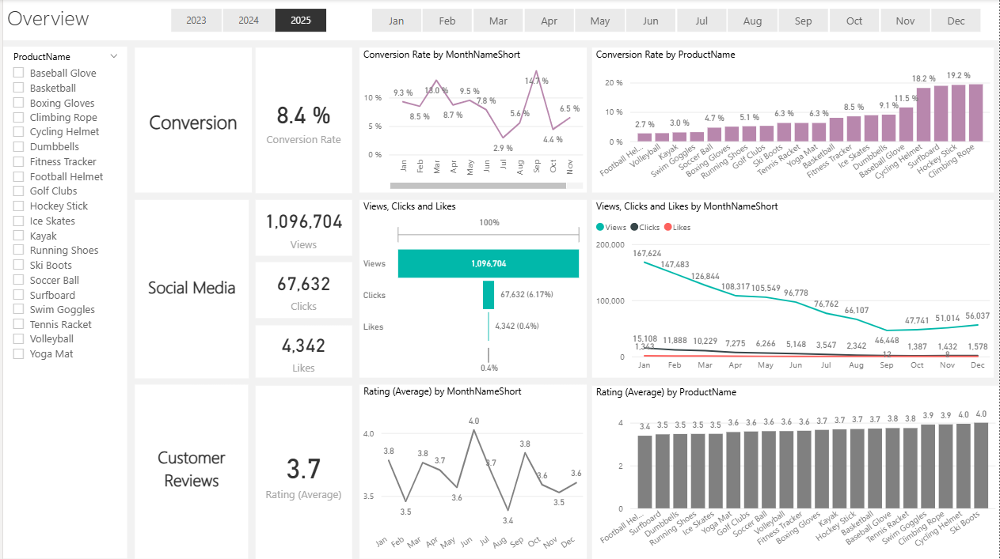

# 📊 Marketing Performance Dashboard (Power BI Project)

## 🚀 Project Overview
This interactive Power BI dashboard was developed to help marketing teams and decision-makers analyze campaign performance, improve conversion rates, and enhance customer satisfaction.

It includes real-time visual KPIs, funnel analysis, customer sentiment, and engagement metrics to support data-driven marketing strategies.

---

## 🎯 Business Goals
1. **Increase Conversion Rates**
   - Identify drop-off stages in the marketing funnel.
   - Recommend UX and targeting improvements.

2. **Enhance Customer Engagement**
   - Understand which content types drive higher engagement.
   - Inform content strategy using interaction data.

3. **Improve Customer Feedback Scores**
   - Extract insights from reviews using sentiment analysis.
   - Guide improvements in product, delivery, and service.

---

## 📊 Key Features & Visuals

- **KPI Cards**: Total Visitors, Conversions, Conversion Rate, ROAS, Ad Spend
- **Funnel Chart**: Visualize user flow from impressions to purchases
- **Engagement Breakdown**: Analyze content performance by type and channel
- **Customer Sentiment**: Word cloud and bar chart showing themes in reviews
- **Campaign Performance Matrix**: CTR, CPA, ROAS by campaign/channel
- **Geo Map**: Conversions by region
- **Filters**: Date, Channel, Device, Campaign, Region

---

## 🛠️ Tools & Technologies
- Power BI (Data Modeling, DAX, Visual Design)
- SQL (Data Cleaning and Transformation)
- Python (Sentiment Analysis with VADER and Text Preprocessing)
- Excel / CSV (Sample Dataset Preparation)
- GitHub (Version Control & Project Sharing)

---

## 🧠 Insights & Recommendations

- **Optimize underperforming campaigns** with low ROAS.
- **Improve landing page UX** where CTR is high but conversions are low.
- **Enhance checkout flow** to reduce cart abandonment.
- **Invest in video and interactive content** that shows higher engagement.
- **Fix operational issues** like delivery delays found in negative reviews.

---

## 📸 Screenshots
## 📸 Dashboard Overview

🔹 Conversion Details Dashboard  

🔹 Customer Review Details  

🔹 Social Media Performance  

---

## 💼 About Me

I'm **Abdullah Saleh**, a junior data analyst transitioning from civil engineering into data analysis and business intelligence.  

---

## ✅ How to Use
1. Download or clone this repository
2. Open the `.pbix` file in Power BI Desktop
3. Explore the dashboard and use slicers to interact with the data
4. Use the visual insights to guide your marketing decisions

---

## 📬 Contact
For any questions or collaborations, reach out at:  
📧 as6235345@gmail.com  
📞 +20 115 840 0944
